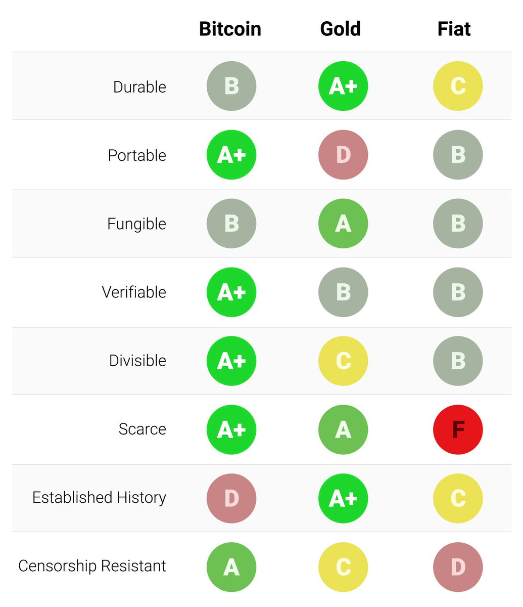
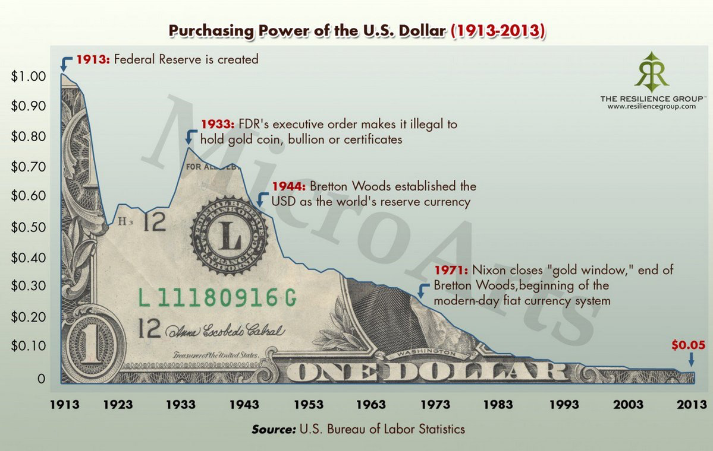

import { Box } from 'rebass'
export { book as theme } from 'mdx-deck/themes' 
import { Image, Appear } from 'mdx-deck'
import { Split } from 'mdx-deck/layouts'

<Box bg="orange" color="black" style={{padding: '2rem'}}>

  

</Box>

---

1. [Money](#Chapter-1)
1. [Primitive Monies](#Chapter-2)
1. [Monetary Metals](#Chapter-3)
1. [Government Money](#Chapter-4)
1. [Money and Time preference](#Chapter-5)
1. [Capitalism Information System](#Chapter-6)
1. [Sound Money and Individual Freedom](#Chapter-7)
1. [Digital Cash](#Chapter-8)
1. [What is Bitcoin Good For?](#Chapter-9)
1. [Bitcoin Questions](#Chapter-1)

---

<h3 id="Chapter-1">Chapter 1: Money</h3>

There are many choices for people's money and no right / wrong but **consequences** of choice

---

Directly exchanging goods through bartering is highly impractical due
to complications of scale, time, and location.

Money solves the problem of moving economic value through time or space. It provides a way to indirectly
transfer between two goods.

---

### Money is:

1. Medium of Exchange
1. Storage of Value
1. Unit of Account

---

### Medium of exchange

Good used solely to exchange for other goods

Money's quintessential function.

---

**Store of Value** Ability to hold value into the future

A good store to value has a high **stock to flow ratio**

**stock** = amount of existing supply
 
**flow** = supply of new money

---

### Unit of account

Item that is most commonly used in trade and serve as metric to measure wealth

Operation of market depends on prices and prices, to be accurate, depend on a common medium of exchange

Only with a medium of exchange acting as a unit of account does complex economic calculations become possible

---
<h3 id="Chapter-2">Chapter 2 Primitive Monies</h3>

Salt, cattle, glass beads, and stones have all functioned as money for a period of time when it
had one of the best stock to flow ratio, but **stopped** when it lost this property.

---

The choice of what makes the best money has always been determined 
by the technological realities of societies shaping the salability of different goods

---

<h3 id="Chapter-3">Chapter 3 Monetary Metals</h3>

Anything used as a store of value will have its supply increased.
And anythings supply that is increased easily will destroy the wealth of those who used it as a store of value.

---

Countries that have used metals w/ low stock to flow ratios
(Silver, copper, tin), all fell victim of having wealth destroyed
over time.

History shows it is not possible to insulate yourself 
from the consequences of others holding money that is harder than yours

---

### Monies Comapred

---

<h3 id="Chapter-4">Chapter 4 Government money</h3>

Biggest scam on the planet

Primitive form of money

It's supply can be increased quickly,
leading to a loss in salability, destruction of purchasing power,
and impoverishment of the population.

---
WW1 was the end of where monetary media is selected by the market, 
and the beginning of the era of government money

It is no coincidence that the era of central bank-controlled money was inaugurated with the first world
war in human history

---

With the simple suspension of gold redemability, 
governments’ war efforts were no longer limited to the money that they had in their own treasuries, 
but extended virtually to the entire wealth of the population

---

### Hyperinflation 

Hyperinflation is a form of economic disaster unique to government money

There was never an example of hyperinflation with economies that operated a gold or silver standard

---

---

<h3 id="Chapter-5">Chapter 5 Money and Time preference</h3>

If government money was a superior storage of value and unit of account,
there would not be any legal tender laws to enforce it.

The fact that govt hold onto their gold and increase reserves testifies to their confidence
in their money long term and inescapable monetary role of gold

---
Unsound money, being controlled by central banks, who's express mission is to keep inflation positive, 
will offer little incentive for holders to keep it.
---
As politicians continue to sell lies that eternal welfare and retirement benefits are possible
through the magic of the printing press, the investment in a family becomes less valuable.
---
The majority of technology we use was invented in the 19th century, under the gold standard,
financed with the ever growing stock of capital accumulated by savers storing their wealth in sound
money and store of value that did not appreciate quickly. 

---
The contributions of sound money to human flourishing can be seen in science, technological advances, and seen in art.

---
<h3 id="Chapter-6">Chapter 6 Capitalism Information System</h3>

Capitalism is what happens when people drop their time preference, defer immediate gratification,
and invest in the future. 

---

Prices are an information system of economic production, communicating knowledge to the world and coordinating
the complex process of production.

Only with prices expressed in a common medium of exchange, is it possible for people to calculate their
comparative advantage and specialize in it.

---

Increasing money does not increase physical capital stock; it only devalues the 
existing money supply and distorts prices

---
<h3 id="Chapter-7">Chapter 7 Sound Money and Individual Freedom</h3>

The fundamental scam of modernity is that governments need to manage the money supply;
and every attempt to manage the money supply has ended in economic disaster

---

### Keynesians and Monetarist 

The two government approved economic theorists 

They use different rationales to reach the same conclusion:

1. government has to expand money supply.
1. deserve more $ to find ever-more-creative ways to suggest gov't expanding money supply
1. Should money supply not expand fast enough (or contract), a deflationary spiral
can take effect

---

### Keynesians

Started by Keynes, a failed investor and statistician

Assume that the most important metric in determining the state of the economy
is the level of aggregate spending across society

---

If spending is too high, leads to inflation and rise in price level, too low and producers reduce production,
fire workers, increasing unemployment resulting in a recession

---
Doesn't attempt to explain **WHY** spending levels might suddenly drop,
and instead blames sudden reduction of spending levels on **"animal spirits"**

Whenever there is a recession, it is due to a drop in spending and solution is for government
to spend more.

---

**Solution** (at complete odds w/ reality):

When economy isn't at full employment, increase money supply to fix problem.

There may be consequences in long run, but no point worrying about long-term
consequences b/c **in the long run, we are all dead.**

---

3 ways to increase aggregate spending:

1. increasing the money supply
1. increasing government spending
1. reducing taxes

---
### Austrian Economics

1. Money emerges in a market as the most marketable commodity ad most
saleable asset
1. Network effects mean one, or a few assets emerge as a medium of exchange
1. The absence of control by govt is necessary condition for soundness of money

---

1. If money supply is fixed, then economic growth will cause prices of real
goods and services to drop. Such a world would encourage saving
and investment of the future where more consumption would happen
1. A society that defers consumption will end up consuming more in the long run than a 
high time preference society, as they invest and produce more income for investors
---

“Hard money, by taking the question of supply out of the hands of governments and
their economist-propagandists, would force everyone to be productive to society instead of seeking to
get rich through the fool’s errand of monetary manipulation”

---

The only cause of economic growth in the first place is delayed gratification, 
saving, and investment, which extend the length of the production cycle and increase 
the productivity of the methods of production, leading to better standards of living

---

Modern artists have replaced craft and long hours of practice with pretentiousness, 
shock value, indignation, and existential angst as ways to cow audiences into appreciating their art, 
and often added some pretense to political ideals, usually of the puerile Marxist variety

---

“Prices are not simply a tool to allow capitalists to profit; 
they are the information system of economic production, communicating knowledge across the world 
and coordinating the complex processes of production”

---

Creating new pieces of paper and digital entries to paper over the deficiency in savings
 does not magically increase society’s physical capital stock; 
 it only devalues the existing money supply and distorts prices

---

<h3 id="Chapter-8">Chapter 8 Digital Money</h3>

Any application of blockchain technology will only make commercial sense if its operation
is reliant on the use of electronic cash, and only if electronic cash’s disintermediation
provides economic benefits outweighing the use of regular currencies and payment channels

---
 

“The Bitcoin ledger of transactions might just be the only objective set of facts in the world”

---

“Whereas in a modern central bank the new money created goes to finance lending and government spending, in Bitcoin the new money goes only to those who spend resources on updating the ledger”
 
“Bitcoin is the cheapest way to buy the future, because Bitcoin is the only medium guaranteed to not be debased, no matter how much its value rises”

---

<h3 id="Chapter-9">Chapter 9 What is Bitcoin Good For?</h3>

Any person who owns Bitcoin achieves a degree of **economic freedom** which was not possible before its invention

---

### Storage of Value

Historically, bitcoin has swung on the posiitve with returns
due to sound monetary policy, and not being controlled

---

### Monetary Exchange

It has proven over 9 years that it works as a monetary exchange.
To function for small purchases, third party applications will
need to be built on top

---

### Unit of Account

Bitcoin will need mass adoption before it is considered a unit of account
Once this happens, people will be able to calculate economic value in 
bitcoin, and bitcoin will be able to take half of every tx.

---

<h3 id="Chapter-1">Chapter 10 Bitcoin Questions</h3>

---

### Altcoins

No coin is likely to overtake Bitcoin as money.
Bitcoin is the first p2p digital cash and it works

Every altcoin has an existential crisis. Bitcoin already
exists and is more secure, and has an established user base.
To compete with Bitcoin, a third party is needed to market and sell the coin.

---

### Ethereum

No monetary policy

Centralized scam that changed txs

The Decentralized Autonomous Organization (DAO) was smart contract. 
People that put money into contract Developer interacted with contract and worked exactly as programmed

Ethereum Foundation forked code and stole funds

---

